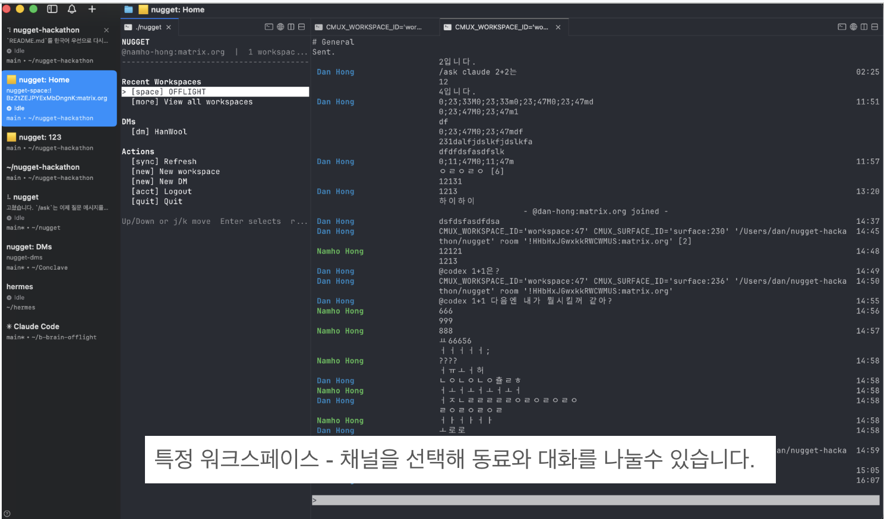
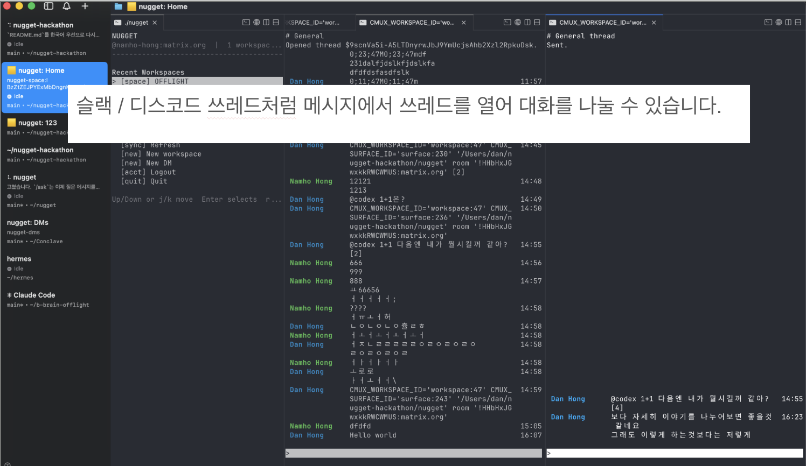
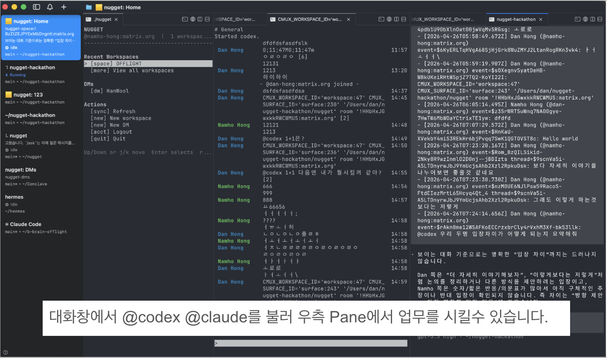

# Nugget

Nugget은 개발팀의 대화와 코딩 에이전트의 작업을 터미널 안에 모아주는
CLI-first 협업 도구입니다.

한 줄로 말하면:

```text
개발자를 위한 터미널 기반 Discord + 코딩 에이전트 작업 공간
```

팀원은 채팅으로 말하고, 에이전트는 터미널에서 일합니다. Nugget은 이 둘을
같은 작업 공간에 붙여서, 대화에서 바로 실행으로 넘어가게 합니다.

## 왜 만들었나

일은 갑자기 빈 화면에서 시작되지 않습니다. 대부분의 일은 대화에서
시작됩니다.

- 누군가 버그를 제보합니다.
- 팀원이 결정 배경을 스레드에 남깁니다.
- 리뷰 요청이 DM으로 옵니다.
- 에이전트에게 일을 맡기려면 앞뒤 대화 맥락이 필요합니다.

그런데 실제 개발자의 작업 공간은 대화 앱이 아니라 터미널입니다. 코드는
터미널에서 실행되고, Codex/Claude/Hermes 같은 코딩 에이전트도 터미널 세션
안에서 일합니다.

기존 방식의 문제는 이 경계에서 생깁니다.

- Discord나 브라우저 채팅의 내용을 터미널로 계속 복사해야 합니다.
- 에이전트가 다른 환경에서 돌면 실제 작업 상태가 블랙박스가 됩니다.
- 사람과 사람의 대화, 사람과 에이전트의 요청, 에이전트의 실행 결과가
  서로 다른 표면에 흩어집니다.

Nugget은 이 경계를 줄이기 위해 만들었습니다. 사람이 대화하는 공간과
에이전트가 일하는 공간을 터미널 안에서 최대한 가깝게 붙입니다.

## 쉽게 말하면

Nugget은 개발자를 위한 "터미널 안의 팀 채팅방"입니다.

일반적인 팀 채팅은 이런 구조입니다.

```text
Discord/Slack
  -> 채널
  -> 스레드
  -> DM
```

Nugget은 이 경험을 터미널 작업 공간으로 가져옵니다.

```text
Nugget
  -> 워크스페이스
  -> 방
  -> 스레드
  -> DM
  -> 옆 pane에서 코딩 에이전트 실행
```

여기서 Matrix는 채팅 서버/프로토콜입니다. 쉽게 말해, Nugget이 직접 채팅
서버를 새로 만든 것이 아니라 이미 존재하는 오픈 채팅 인프라 위에
터미널용 협업 경험을 만든 것입니다.

cmux는 터미널 안에서 여러 작업 화면을 나란히 띄워주는 워크스페이스입니다.
Nugget은 cmux를 이용해 채팅방, 스레드, 에이전트 실행 화면을 한 화면 안에
배치합니다.

## 무엇을 해결하나

Nugget은 팀 채팅을 단순히 터미널에 표시하는 도구가 아닙니다.

핵심은 **대화의 맥락을 작업 공간으로 바로 이어 주는 것**입니다.

- 프로젝트별 워크스페이스를 만듭니다.
- 워크스페이스 안에 채팅방을 둡니다.
- 중요한 메시지는 스레드로 열어 맥락을 좁힙니다.
- 같은 터미널 화면 안에 방, DM, 스레드, 에이전트 pane을 나란히 둡니다.
- `@codex`, `@claude`, `@hermes`로 로컬 에이전트를 호출하면 최근 대화,
  room/thread ID, cmux pane/surface 정보가 프롬프트에 같이 들어갑니다.

즉, Nugget은 대화를 "읽는 곳"과 일을 "하는 곳"을 분리하지 않습니다.

## 왜 지금 필요한가

코딩 에이전트가 많아질수록 개발자의 실제 문제는 "모델에게 무엇을 시킬까"가
아니라 "어떤 맥락에서 일을 시킬까"가 됩니다.

팀 대화에는 이미 중요한 맥락이 들어 있습니다.

- 왜 이 작업을 해야 하는지
- 누가 어떤 결정을 했는지
- 어떤 버그가 재현됐는지
- 어떤 파일이나 명령을 봐야 하는지

하지만 이 맥락이 채팅 앱에 갇혀 있으면 에이전트는 다시 설명을 요구합니다.
Nugget은 이 대화 맥락을 터미널과 에이전트 실행 환경에 바로 연결합니다.

## 핵심 경험

```text
./nugget
  -> Matrix 로그인
  -> 워크스페이스 선택
  -> 방 열기
  -> 대화 읽기/보내기
  -> 메시지에서 스레드 열기
  -> @codex summarize this thread
  -> 대화 옆에 로컬 에이전트 pane 실행
```

이 흐름에서 중요한 점은 에이전트가 빈 프롬프트에서 시작하지 않는다는
것입니다. Nugget은 에이전트에게 어떤 방/스레드에서 호출됐는지, 최근
메시지는 무엇인지, 어떤 cmux surface 옆에서 실행되는지를 함께 넘깁니다.

## 화면 예시

특정 워크스페이스와 채널을 선택해 동료와 대화할 수 있습니다.



Slack/Discord처럼 메시지에서 스레드를 열어 대화를 나눌 수 있습니다.



대화창에서 `@codex`나 `@claude`를 불러 오른쪽 pane에서 업무를 시킬 수
있습니다.



## 지금 되는 것

- Matrix SSO 로그인
- 터미널 홈 메뉴
- 최근 워크스페이스, DM, 초대 목록
- 프로젝트 워크스페이스 생성
- 워크스페이스 안에 room 생성
- DM 생성 및 초대
- room/thread 터미널 채팅 뷰
- 입력 중 새 메시지가 와도 composer 유지
- `/select`로 메시지를 선택해 thread pane 열기
- cmux workspace/pane/surface 연동
- `@codex`, `@claude`, `@hermes` 로컬 에이전트 pane 실행
- `nugget doctor` 로컬 세션 및 cmux 진단

## 설치

필요한 것:

- Node.js 22+
- pnpm
- 실제 채팅 사용을 위한 Matrix 계정
- 여러 pane/workspace 데모를 위한 cmux
- 선택 사항: `codex`, `claude`, `hermes` 로컬 CLI

```sh
pnpm install
pnpm build
```

실행:

```sh
./nugget --help
./nugget login
./nugget
```

전역 명령으로 설치:

```sh
pnpm link --global
nugget --help
nugget login
nugget
```

전역 설치 후에는 어느 디렉터리에서든 `nugget` 명령을 사용할 수 있습니다.

## 기본 사용 흐름

Nugget의 기본 사용 방식은 명령어를 계속 외워서 치는 것이 아니라,
`nugget`으로 홈 화면을 열고 키보드로 이동하는 것입니다.

```sh
nugget
```

홈 화면에서 할 수 있는 일:

```text
Recent Workspaces
  -> 최근 열었던 워크스페이스로 이동
  -> View all workspaces

DMs
  -> 최근 DM 열기

Actions
  -> Refresh
  -> New workspace
  -> New DM
  -> Logout
  -> Quit
```

조작:

```text
Up/Down 또는 j/k  이동
Enter             선택
r                 새로고침
q                 종료
```

워크스페이스를 선택하면 room picker가 열리고, 그 안에서 채널을 선택해 대화를
시작합니다. 방 안에서는 일반 채팅처럼 메시지를 입력하고 Enter를 누르면 됩니다.

방 안에서 자주 쓰는 입력:

```text
/help
/invite @user:server
/select
@codex summarize the recent discussion
@claude draft a reply based on this thread
@hermes inspect the latest error context
```

직접 명령어는 데모 준비나 특정 방을 바로 열 때 쓰는 보조 수단입니다.

```sh
nugget doctor
nugget room "<room-id>"
nugget workspace "<space-id>"
nugget send "<room-id>" "hello from the terminal"
```

## 기능별 사용 방법

### 1. 로그인하기

```sh
nugget login
```

브라우저에서 Matrix SSO 로그인을 완료하면 Nugget이 로컬 세션을 저장합니다.
이후에는 `nugget`만 실행해도 홈 메뉴로 들어갑니다.

현재 로그인 상태를 확인하려면:

```sh
nugget whoami
```

로그아웃하려면:

```sh
nugget logout
```

### 2. 홈 메뉴 열기

```sh
nugget
```

홈 메뉴가 Nugget의 시작점입니다. 최근 워크스페이스와 DM을 바로 열거나,
`New workspace`, `New DM`, `Refresh`, `Logout`, `Quit` 같은 액션을 선택할 수
있습니다.

### 3. 워크스페이스 만들기

홈 메뉴에서:

```text
Actions -> New workspace
```

워크스페이스 이름을 입력하면 새 프로젝트 대화 공간이 만들어집니다.

명령어로 만들 수도 있습니다:

```sh
nugget create-workspace "Hackathon"
```

Nugget에서 워크스페이스는 프로젝트 단위의 대화 공간입니다. 내부적으로는
Matrix Space로 저장되고, cmux에서는 터미널 워크스페이스로 열립니다.

워크스페이스를 열 때는 보통 홈 화면의 `Recent Workspaces`나
`View all workspaces`에서 선택합니다. ID를 알고 있으면 명령어로도 열 수
있습니다:

```sh
nugget workspace "<space-id>"
```

### 4. 워크스페이스에서 방 열기

워크스페이스를 선택하면 room picker가 열립니다. 여기서 채널을 선택하면
오른쪽 pane에 채팅방이 열립니다.

```text
Home
  -> Recent Workspaces
  -> workspace 선택
  -> room picker
  -> room 선택
```

방 ID를 알고 있으면 직접 열 수도 있습니다:

```sh
nugget room "<room-id>"
```

### 5. 방 만들기

현재 빌드에서는 새 room 생성은 명령어로 실행합니다.

```sh
nugget create-room "demo" "<space-id>"
```

워크스페이스 안에 새 대화방을 만든 뒤, 홈 화면에서 워크스페이스를 다시 열거나
room picker를 새로고침하면 방을 선택할 수 있습니다.

전체 room 목록에서 고르고 싶으면:

```sh
nugget open
```

### 6. 메시지 보내기

채팅 화면에서 그냥 입력하고 Enter를 누르면 메시지가 전송됩니다.

한 번만 보내고 종료하려면:

```sh
nugget send "<room-id>" "hello from the terminal"
```

### 7. 사람 초대하기

채팅 화면 안에서:

```text
/invite @user:server
```

명령어로 직접 초대하려면:

```sh
nugget invite "<room-id>" "@user:server"
```

### 8. DM 만들기

홈 메뉴에서:

```text
Actions -> New DM
```

상대 Matrix ID를 입력하면 DM을 만들 수 있습니다.

명령어로 만들 수도 있습니다:

```sh
nugget create-dm "@user:server"
```

### 9. 스레드 열기

방 안에서:

```text
/select
```

방향키로 메시지를 고른 뒤 Enter를 누르면 해당 메시지의 스레드가 옆 pane에
열립니다. cmux 안에서 실행 중이어야 옆 pane 배치가 동작합니다.

스레드를 직접 열려면:

```sh
nugget thread "<room-id>" "<thread-root-event-id>"
```

### 10. 에이전트 호출하기

방이나 스레드 안에서:

```text
@codex summarize this thread
@claude draft a reply
@hermes inspect the latest error
```

Nugget은 해당 메시지를 채팅에 남기고, 동시에 로컬 에이전트 pane을 엽니다.
에이전트에게는 최근 대화, room/thread 정보, 현재 cmux 위치가 함께 전달됩니다.

### 11. 문제 진단하기

```sh
nugget doctor
```

로컬 Matrix 세션, Nugget 상태 파일, cmux 연결 상태를 확인합니다.

## 3분 데모 시나리오

1. `./nugget` 실행
2. Matrix 워크스페이스 선택 또는 생성
3. 워크스페이스 room picker에서 방 열기
4. 실제 Matrix 메시지 송수신 보여주기
5. `/select`로 메시지를 골라 thread pane 열기
6. thread에서 `@codex summarize this thread` 입력
7. 대화 옆에 agent pane이 열리고, 대화 맥락이 prompt로 전달되는 것 보여주기

이 데모는 Nugget의 핵심을 보여줍니다:

```text
chat -> thread -> agent pane -> context-aware local work
```

## 해커톤에서 보여줄 포인트

심사위원이 기술 배경이 다르더라도 이 메시지가 바로 보여야 합니다.

> 개발팀의 대화는 이미 업무의 맥락이다. Nugget은 그 맥락을 터미널과
> 코딩 에이전트에게 바로 연결한다.

데모에서 보여줄 장면은 하나입니다.

```text
팀 대화
-> 터미널 채팅방
-> 스레드
-> @codex 호출
-> 대화 맥락을 가진 로컬 에이전트 실행
```

이 장면만 성공하면 Nugget이 왜 필요한지 설명됩니다.

## Developer Tooling 트랙 적합성

공식 평가 기준에 맞춰 보면 Nugget은 다음 지점에 집중합니다.

### Technical Depth 30%

Nugget은 단순 API wrapper가 아닙니다.

- Matrix SSO/session 저장
- Matrix Space/room/DM/thread 모델링
- room membership, invite, leave 처리
- terminal chat rendering
- cmux workspace/pane/surface orchestration
- 로컬 agent command 실행
- agent prompt context 생성

이 여러 시스템을 하나의 CLI workflow로 연결합니다.

### Developer Experience 25%

개발자가 실제로 쓰는 터미널 흐름을 우선합니다.

- `./nugget` 하나로 홈 메뉴 진입
- 최근 workspace/DM 중심 탐색
- keyboard-friendly picker
- room/thread 안에서 slash command 사용
- 실패 시 `nugget doctor`와 actionable error 제공

### Usefulness & Real-World Fit 25%

Nugget이 푸는 문제는 명확합니다.

개발자는 이미 터미널에서 일하고, 에이전트도 터미널에서 돌고 있습니다.
하지만 팀 대화는 보통 다른 앱에 있습니다. Nugget은 이 둘을 붙여서
대화에서 바로 작업으로 넘어가게 합니다.

특히 코딩 에이전트를 여러 개 쓰는 환경에서 유용합니다.

- 사람이 한 말을 에이전트에게 다시 설명하지 않아도 됩니다.
- 에이전트가 어떤 대화에서 시작됐는지 추적할 수 있습니다.
- room/thread/context가 터미널 workspace 안에 남습니다.

### Demo & Presentation 10%

짧은 데모에서 보여줄 수 있는 흐름이 분명합니다.

```text
팀 대화가 생김
-> 터미널에서 같은 방을 엶
-> 스레드로 맥락을 좁힘
-> @codex로 에이전트 실행
-> 에이전트가 대화 맥락을 가진 상태로 작업 시작
```

### Judge's Personal Rating 10%

Nugget은 "터미널에서 Discord를 다시 만든다"가 목표가 아닙니다.

심사위원에게 보여주고 싶은 지점은 이것입니다:

> 에이전트 시대의 협업 도구는 채팅 앱과 터미널이 분리되어 있으면 안 된다.

Nugget은 이 문제를 Matrix와 cmux를 이용해 CLI-first 방식으로 풀어봅니다.

## 기술 구조

```text
Open chat infrastructure (Matrix)
  -> project workspaces
  -> rooms
  -> DMs
  -> threads

Local terminal workspace (cmux)
  -> room panes
  -> thread panes
  -> agent panes
```

Matrix는 채팅 계정, 방, DM, 스레드, 메시지 저장을 담당합니다.
cmux는 로컬 터미널 화면 배치를 담당합니다.
Nugget은 둘을 연결해서 개발자가 쓰는 제품 경험을 만듭니다.

주요 디렉터리:

- `src/matrix/`: login, sync, rooms, Spaces, DMs, invites, creation APIs
- `src/ui/`: terminal home menu, workspace picker, chat view, thread view
- `src/cmux/`: workspace, pane, surface, notification, agent orchestration
- `src/agent/`: agent command configuration, context prompt generation
- `src/store/`: local Matrix session, Nugget app state

## 검증

Matrix 계정 없이 가능한 확인:

```sh
pnpm build
pnpm test
./nugget --help
./nugget doctor
```

Matrix 계정과 cmux가 필요한 수동 확인:

```sh
./nugget login
./nugget workspace "<joined-space-id>"
```

---

## English Summary

Nugget is a CLI-first Matrix client for coordinating humans and coding agents
inside terminal workspaces.

It brings Discord-like work conversations into the place where developer work is
already happening: the terminal. Matrix provides durable rooms, DMs, Spaces, and
threads. cmux provides the local terminal workspace. Nugget connects them so a
conversation, a thread, and an agent session can sit next to the code instead of
living in separate apps.

The core demo is:

```text
chat -> thread -> local agent pane -> context-aware terminal work
```

For the Developer Tooling track, Nugget focuses on technical depth, terminal
developer experience, real-world usefulness, and a clear live demo of agent
orchestration from chat context.
